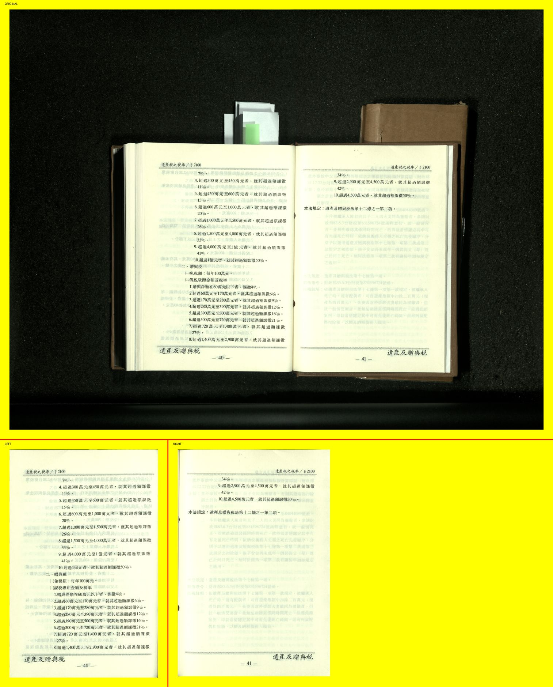

# MagazineCrop

<p align="center">
    
    
</p>

MagazineCrop is a tool designed to crop and dewarp scanned book pages. It automates the process of removing backgrounds, splitting pages, and correcting page curvature for scanned books.

## Table of Contents
- [Installation](#installation)
- [Usage](#usage)
- [TODO](#todo)

## Installation

### 1. Clone the Repository
Clone the entire project to your desired directory:
```bash
git clone git@github.com:mio0115/MagazineCrop.git
```

### 2. Prepare the Environment
Install the environment with:
```bash
conda env create -f environment.yml
```

### 3. Download Models
Download the required models and place them in the following directories:

- Create the directories (if they don't already exist):
  ```bash
  mkdir -p ./src/remove_background/checkpoints ./src/split_page/checkpoints
  ```

- Move `rm_bg_model.pth`:
    ```bash
    mv /path/to/rm_bg_model.pth <project_root>/src/remove_background/checkpoints/
    ```

- Move `sp_pg_model.pth`:
    ```bash
    mv /path/to/sp_pg_model.pth <project_root>/src/split_page/checkpoints/
    ```

## Usage

### 1. Running Inference
To process your scanned images, run:
```bash
python -m src.run --input-image /path/to/images/<image_name>.tif --output-directory /path/to/output
```

### 2. Optional Parameters

- `--single-page`: If the input image has only one page. We assume that there are 2 pages in the given image by default.
- `--scale-factor`: A parameter to scale the output image by height and width (default: 1.0 (no scaled)).
- `--use-gpu`:  Use GPU instead of CPU.

## TODO
- [ ] Develop a RESTful API using FastAPI
- [ ] Make it run in a Docker container